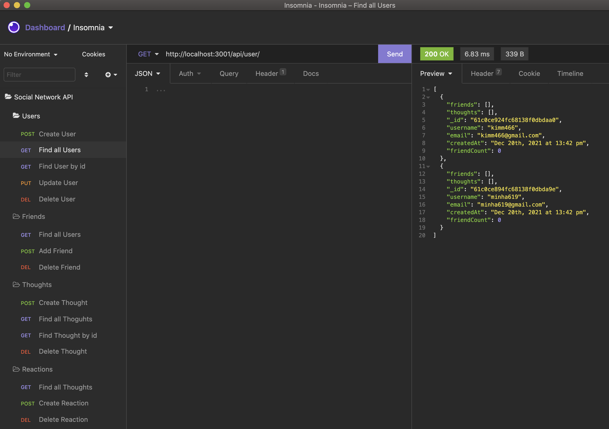

# Social Network API

## Description
An API for a social network web application where users can share their thoughts, react to friends’ thoughts, and create a friend list.

## Usage
In your command line:

 -Type below to start the server
 ```
 node server.js
 ```
## Screenshot


## Demo Video
1. Social Network API for [USERS](https://drive.google.com/file/d/1yEOTKRX4KAKl7Hpcbhvqq9owfptAzXuY/view?usp=sharing)
2. Social Network API for [FRIENDS](https://drive.google.com/file/d/156d8WMFiuCJTU5RTcAQ6Aao3waGDQGy_/view?usp=sharing)
3. Social Network API for [THOUGHTS](https://drive.google.com/file/d/15SOSad5Lk9n-Pjk5v8uN2Gt75u-H8Od5/view?usp=sharing)
4. Social Network API for [REACTIONS](https://drive.google.com/file/d/1Bu4OFrOgMt5pRDuyhErNBj4N19DBZHuG/view?usp=sharing)

